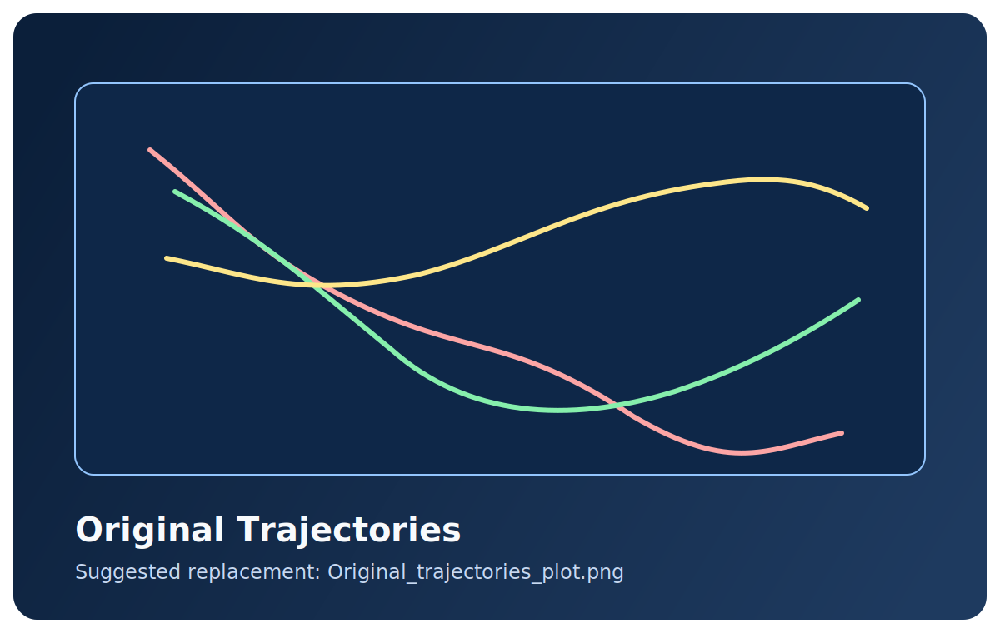
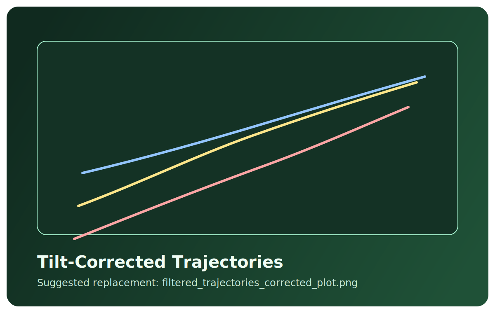
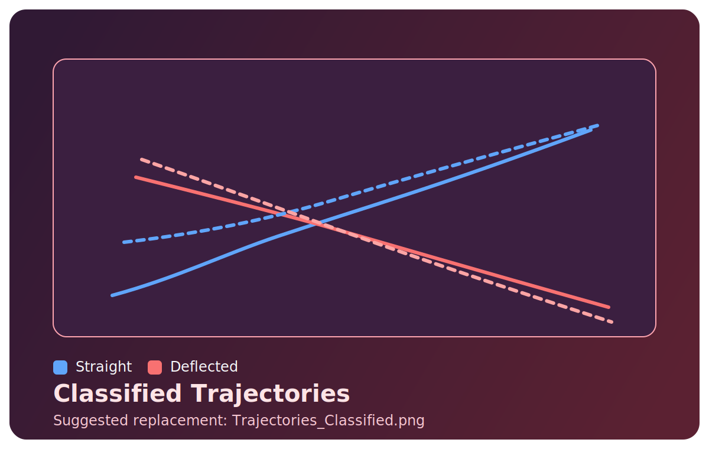
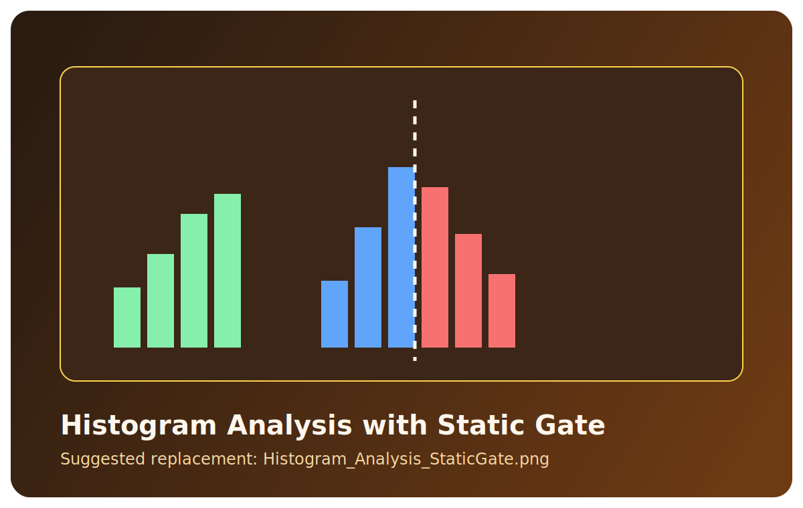
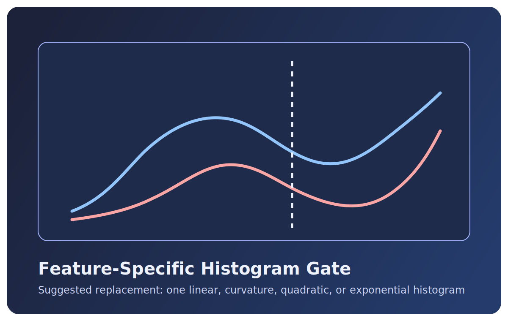

# CellTrajectoryAnalyzer

<div align="center">

Cell tracking, trajectory correction, and histogram-based population analysis for microscopy videos of flowing cells.

<p>
  
  
  
  
  
  
</p>

</div>

This repository brings together three connected workflows:

1. Cell detection and tracking in video frames.
2. Trajectory filtering and tilt correction.
3. Histogram-based population analysis and trajectory classification.

The codebase is organized around reusable modules for tracking (`tracking/`), trajectory visualization and correction (`trajectoryplot/`), and downstream deflection analysis (`defanalysis/`).

## Demo Preview

The `assets/` folder is ready for media you want to showcase in the project page. A preview card is included now, and you can later replace it with a GIF or update the README to point to your exported video.


Suggested media targets:

- `assets/video/cell-flow-preview.gif` for an inline animated preview
- `assets/video/cell-flow-demo.mp4` for the full video

See [assets/README.md](assets/README.md) for the exact folder layout and suggested filenames.

## What This Project Does

- Tracks cells across frames using either a centroid tracker or `SORT`
- Uses `OpenCV` preprocessing steps such as CLAHE, background subtraction, blurring, thresholding, and contour detection
- Saves annotated tracking video plus frame-by-frame CSV outputs
- Filters short trajectories and generates trajectory visualizations
- Supports tilt correction using Sobel, Scharr-RANSAC, ridge-based, zonal, or manual workflows
- Compares experiment and control populations with histogram-based gating
- Produces trajectory classifications, curvature plots, fit diagnostics, and summary reports

## Core Technologies

| Area | Libraries / Tools |
| --- | --- |
| Video I/O and image processing | `OpenCV` |
| Numerical computation | `NumPy` |
| Tables and CSV handling | `Pandas` |
| Plotting and scientific visualization | `Matplotlib` |
| Curve fitting and statistics | `SciPy` |
| Image utilities | `scikit-image` |
| Multi-object tracking | `SORT`, `filterpy` |
| Project code | `tracking/`, `trajectoryplot/`, `defanalysis/` |

## Pipeline Overview

```mermaid
flowchart LR
    A[Microscopy Video] --> B[Frame Preprocessing<br/>CLAHE, subtraction, blur, threshold]
    B --> C[Cell Detection<br/>Contours plus enclosing circles]
    C --> D[Tracking<br/>SORT or centroid tracker]
    D --> E[Trajectory CSVs<br/>IDs, frame counts, radii]
    E --> F[Trajectory Filtering<br/>Minimum frame threshold]
    F --> G[Tilt Correction<br/>Sobel, Scharr, ridge, manual]
    G --> H[Population Analysis<br/>Fits, gating, classification]
    H --> I[Plots, reports, and annotated outputs]
```



## Repository Layout

```text
CellTrajectoryAnalyzer/
|- tracking/          # tracking pipeline, preprocessing, detection, visualization
|- trajectoryplot/    # trajectory filtering, plotting, tilt correction
|- defanalysis/       # histogram gating, fit diagnostics, classification, reporting
|- assets/            # README media and plot showcase placeholders
|- your_video/        # sample output CSVs
`- main.py            # current orchestration script
```

## Quick Start

Install the main dependencies:

```bash
pip install numpy pandas matplotlib scipy scikit-image opencv-python filterpy
```

Then run the pipeline from `main.py` after updating the hard-coded input paths to your own video locations:

```bash
python main.py
```

Typical outputs from the current workflow include:

- Annotated tracking video such as `Recorded_Annotated.avi`
- Sample frames such as `OriginalFrame.png`, `GrayImage.png`, and `Threshold.png`
- Trajectory plots such as `Original_trajectories_plot.png` and `filtered_trajectories_corrected_plot.png`
- Population analysis plots such as `Histogram_Analysis_StaticGate.png` and `Trajectories_Classified.png`

## Example Visual Outputs

These placeholder cards are already wired into the repo structure so you can swap in your real figures later.

| Trajectory overview | Tilt-corrected trajectories |
| --- | --- |
|  |  |

| Classified trajectories | Histogram-based gating |
| --- | --- |
|  |  |

| Feature histogram |
| --- |
|  |

## Notes

- `tracking/pipeline.py` is the main entry point for video tracking and annotated output generation.
- `trajectoryplot/trajectory.py` handles trajectory filtering, tilt estimation, and corrected trajectory plots.
- `defanalysis/deflection_analysis.py` handles gating, fit diagnostics, histogram analysis, and classification outputs.
- The `assets/` folder was added as a presentation layer for README media, separate from raw experiment outputs.
